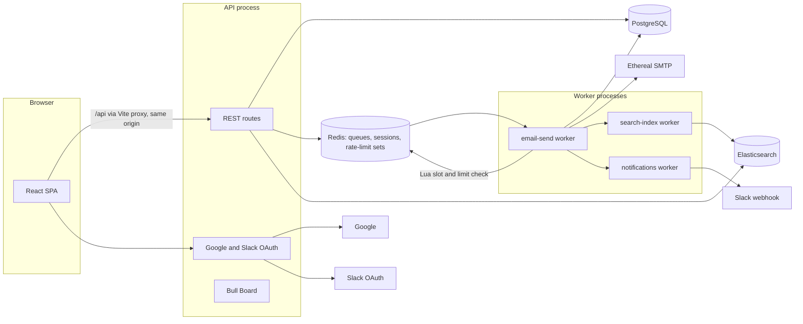

# Outbox Scheduler

A full-stack email scheduling system inspired by ReachInbox, built for the Outbox Labs SDE Intern assignment.

You sign in with Google, upload a CSV of leads and schedule a campaign. A pool of BullMQ workers then sends the emails through Ethereal SMTP. Sending respects a per-sender minimum gap and hourly limits, both coordinated through Redis. Everything survives restarts, no email is sent twice by the system, and a Slack message is posted when a sender hits its hourly limit.

---

## 1. Project overview

| Piece | Responsibility |
|---|---|
| React SPA (`frontend/`) | Login, dashboard, compose, CSV upload, search, settings |
| API process (`backend/src/server.ts`) | REST API, Google/Slack OAuth, validation, persistence, enqueueing, Bull Board |
| Worker process (`backend/src/worker.ts`) | Consumes BullMQ jobs, enforces pacing and limits, sends over SMTP, indexes into Elasticsearch, posts Slack alerts |
| PostgreSQL | Source of truth for users, senders, campaigns, emails and their history |
| Redis | BullMQ queues, sessions, OAuth state, rolling-window rate-limit sorted sets, send slots |
| Elasticsearch | Full-text search over scheduled and sent emails (derived data) |

The core rule: **Postgres decides what happened to an email, BullMQ only decides when a worker looks at it.**

## 2. Features

- Real Google OAuth 2.0 / OpenID Connect login (authorization code, PKCE S256, `state`, `nonce`, verified ID token)
- Server-side sessions in Redis with HttpOnly, Secure, SameSite=Lax cookies; logout revokes the session
- Multiple senders per user: one-click Ethereal test accounts or any SMTP server (password encrypted with AES-256-GCM)
- CSV/TXT upload or pasted text; emails are detected, validated, de-duplicated, and counted as "Detected X email addresses"
- Campaign scheduling with start time, delay between emails and hourly limit; `Idempotency-Key` protects against double submits
- BullMQ delayed jobs, one per email (`jobId = emailId`), with retries, exponential backoff, cleanup policy and configurable concurrency
- Minimum gap between sends, plus rolling-window hourly limits per sender and per campaign, enforced by one atomic Redis Lua script over sorted sets across any number of workers
- Rate-limited emails are rescheduled to the moment the oldest counted send leaves the rolling window, never dropped, and keep their order
- Real Slack OAuth (`incoming-webhook`), encrypted token storage, connect, test, reconnect, disconnect, and at most one alert per sender or campaign per rolling window
- Elasticsearch index with a custom email analyzer, asynchronous versioned indexing, search API and a search box in the UI
- Bull Board at `/admin/queues`, restricted to emails listed in `ADMIN_EMAILS`
- Restart safety: AOF-persisted Redis, compare-and-set claims, stalled-job recovery, and startup reconciliation
- Structured pino logs with request IDs and redaction; central error handler with a single error shape
- Loading, empty and error states, plus toasts, across the UI

## 3. Architecture



Life of one email:

1. `POST /api/leads/parse` turns a CSV into a clean list of addresses.
2. `POST /api/campaigns` with an `Idempotency-Key` validates the request. In one transaction it inserts the campaign, one `emails` row per recipient (`scheduled_at = startAt + i × delay`) and a `scheduled` event.
3. After the commit, the API calls `addBulk` with one delayed job per email: `jobId = emailId` and `delay = scheduled_at - now`.
4. When a job becomes due, a worker loads the row. If it is already `sent` or `failed`, the job ends.
5. The worker runs the atomic Lua reservation (`RESERVE_SEND_SLOT_LUA`, registered as the ioredis command `outboxReserveSendSlot`). The script either reserves the next free slot for the sender, or reports that the sender's or campaign's rolling window already holds its limit.
6. If the slot is in the future, the job moves back to delayed until that slot. If a limit is reached, the row becomes `rate_limited` and the job is delayed until the oldest counted send leaves the rolling window.
7. Otherwise the worker claims the row (`scheduled/rate_limited → processing`, compare-and-set) and sends over SMTP with a deterministic `Message-ID`.
8. The row becomes `sent`, or `scheduled` with a retry, or `failed`. An event is written in the same transaction, and a search-index job is queued.

## 4. Tech stack

| Layer | Choice |
|---|---|
| Backend | Node.js 22, TypeScript 6, Express 5, zod, pino |
| Queue | BullMQ 6 on ioredis 5.11 |
| Database | PostgreSQL 18 via Prisma 7 (driver adapter `@prisma/adapter-pg`) |
| Search | Elasticsearch 9.5 with `@elastic/elasticsearch` 9 |
| Email | Nodemailer 10 with Ethereal |
| Auth | `google-auth-library` (ID token verification), own Redis session store |
| Queue UI | Bull Board 9 |
| Frontend | React 19, Vite 8, Tailwind CSS 4, React Router 7, TanStack Query 5, lucide-react |
| Tests | Vitest 5, Supertest |
| Infra | Docker Compose (Postgres, Redis with AOF, Elasticsearch single node) |

TypeScript 6 is used instead of 7 because 7 removed the JavaScript compiler API that some tooling still needs.

## 5. Folder structure

```
OUTBOX-project/
  docker-compose.yml
  .env.example
  README.md
  backend/
    prisma/
      schema.prisma
      migrations/
    prisma.config.ts
    scripts/
      db-migrate.ts
      search-reindex.ts
    src/
      config/env.ts
      infra/
      middleware/
      modules/
        admin/
        auth/
        campaigns/
        delivery/
        emails/
        health/
        leads/
        search/
        senders/
        slack/
      queues/
      types/
      utils/
      app.ts
      server.ts
      worker.ts
    tests/
  frontend/
    src/
      components/
        auth/
        compose/
        email/
        layout/
        ui/
      context/
      hooks/
      layouts/
      lib/
      pages/
      services/
      types/
      App.tsx
      main.tsx
```

The backend is organised by feature. Each module owns its routes, service and schema. Shared clients (Prisma, Redis, Elasticsearch, the logger, the mailer) live in `infra/`.

## 6. Prerequisites

- Node.js 22.12 or newer
- Docker Desktop with Docker Compose v2
- A Google Cloud project for OAuth credentials
- A Slack workspace where you can install apps (optional; alerts are skipped without it)

## 7. Installation

```bash
git clone https://github.com/Shashank-sys-ux/Outbox-project.git
cd Outbox-project
docker compose up -d
cd backend
npm install
cp .env.example .env
npm run db:deploy
cd ../frontend
npm install
```

`npm install` in `backend/` also runs `prisma generate` through `postinstall`.

Generate the two secrets and paste them into `backend/.env`:

```bash
node -e "console.log(require('crypto').randomBytes(48).toString('base64url'))"
node -e "console.log(require('crypto').randomBytes(32).toString('base64'))"
```

The first is `SESSION_SECRET` and the second is `ENCRYPTION_KEY`.

## 8. Environment variables

All backend configuration is validated with zod at startup. If a value is missing or invalid, the process refuses to start and names the variable.

| Variable | Default | Purpose |
|---|---|---|
| `APP_URL` | `https://localhost:5173` | Public origin of the SPA; OAuth redirects and the CSRF origin check use it |
| `PORT` | `4000` | API port |
| `DATABASE_URL` | required | Postgres connection string |
| `DATABASE_POOL_MAX` | `10` | pg pool size per process |
| `REDIS_URL` | required | Redis connection string |
| `ELASTICSEARCH_URL` / `ELASTICSEARCH_INDEX` | required / `outbox-emails` | Search cluster and index name |
| `SESSION_SECRET` | required | HMAC key used to derive Redis session keys (at least 32 characters) |
| `SESSION_TTL_SECONDS` | `604800` | Session lifetime |
| `COOKIE_SECURE` | `true` | Secure flag on cookies |
| `ENCRYPTION_KEY` | required | 32-byte base64 key for AES-256-GCM (SMTP passwords, Slack tokens) |
| `GOOGLE_CLIENT_ID` / `GOOGLE_CLIENT_SECRET` / `GOOGLE_CALLBACK_URL` | empty | Google OAuth client |
| `SLACK_CLIENT_ID` / `SLACK_CLIENT_SECRET` / `SLACK_REDIRECT_URI` | empty | Slack OAuth app; the redirect must be https |
| `ETHEREAL_HOST` / `ETHEREAL_PORT` / `ETHEREAL_USER` / `ETHEREAL_PASSWORD` | Ethereal defaults | If a user and password are set, each new user gets them as a default sender |
| `ADMIN_EMAILS` | empty | Comma-separated emails allowed to open Bull Board |
| `BULL_BOARD_READ_ONLY` | `false` | Hide retry and delete actions in Bull Board |
| `WORKER_CONCURRENCY` | `5` | Jobs processed in parallel per worker process |
| `MIN_SEND_DELAY_MS` | `2000` | Minimum gap between two sends of the same sender |
| `MAX_EMAILS_PER_HOUR_PER_SENDER` | `200` | Sender limit per rolling window; also the maximum campaign hourly limit |
| `RATE_LIMIT_WINDOW_MS` | `3600000` | Length of the rolling rate-limit window. Keep 1 hour for real use; set `60000` for a quick demo |
| `EMAIL_MAX_ATTEMPTS` / `EMAIL_RETRY_BACKOFF_MS` | `5` / `30000` | Retries for temporary SMTP failures, with exponential backoff |
| `EMAIL_LOCK_DURATION_MS` | `30000` | BullMQ job lock; also the age after which a `processing` claim counts as abandoned |
| `SMTP_TIMEOUT_MS` | `20000` | Connection, greeting and socket timeouts |
| `UPLOAD_MAX_BYTES` / `MAX_RECIPIENTS_PER_CAMPAIGN` | 5 MB / `10000` | Upload and campaign size limits |
| `API_RATE_LIMIT_PER_MINUTE` / `AUTH_RATE_LIMIT_PER_MINUTE` | `300` / `30` | Redis-backed API throttling |

The root `.env.example` only overrides Docker ports and passwords. The optional `frontend/.env.example` holds `BACKEND_URL` and `DEV_HTTPS`.

## 9. Docker setup

```bash
docker compose up -d
docker compose ps
```

All three services have healthchecks and `restart: unless-stopped`. Ports are bound to `127.0.0.1` only. Data lives in named volumes (`pgdata`, `redisdata`, `esdata`):

- `docker compose down` keeps your data.
- `docker compose down -v` wipes it.

The API, worker and frontend run on the host with `npm` for fast reloads.

## 10. Database setup

```bash
cd backend
npm run db:deploy
npm run db:status
```

Six tables:

| Table | Holds |
|---|---|
| `users` | Google identity, keyed by `google_sub` |
| `senders` | SMTP settings with the password encrypted; unique per user and email |
| `campaigns` | Subject, body, schedule settings, `idempotency_key` and `request_hash`; unique per user and key |
| `emails` | One row per recipient: status, `scheduled_at`, `next_attempt_at`, attempts, `claimed_at`, `completed_at`, message ID, preview URL; unique per campaign and recipient |
| `email_events` | Append-only history of every state change |
| `slack_connections` | Team, channel, encrypted webhook URL and access token, one per user |

`emails.user_id` and `emails.sender_id` are copied from the campaign so dashboard and limiter queries need no join. These values never change after insert.

Indexes cover the Scheduled tab (`user_id, status, next_attempt_at`), the Sent tab (`user_id, status, completed_at desc`) and reconciliation (`status, next_attempt_at`). Primary keys are UUID v7, so inserts are time-ordered.

To create a new migration, run `npm run db:migrate -- <name>`. The script also strips Prisma's auto-generated comments before applying the migration.

## 11. Redis setup

Redis runs with:

- `--appendonly yes --appendfsync everysec`: delayed jobs survive a restart, with at most about 1 second of writes at risk.
- `--maxmemory-policy noeviction`: Redis never silently deletes queue keys.

Keys used by the app:

| Key | Purpose |
|---|---|
| `bull:<queue>:*` | BullMQ |
| `sess:<hmac(sessionId)>` | Sessions. The raw cookie value is never stored |
| `oauth:<provider>:<state>` | One-time OAuth state, 10 minute TTL, read with `GETDEL` |
| `rl:{s:<senderId>}:last_slot` | Last reserved send time for the sender (string, enforces the minimum gap) |
| `rl:{s:<senderId>}:slots` | Sorted set of the sender's reserved sends: member = email ID, score = slot time in ms |
| `rl:{s:<senderId>}:campaign:<campaignId>:slots` | Same sorted set, scoped to one campaign |
| `rl:{s:<senderId>}:alerted:<scope>:<scopeId>` | Slack alert de-duplication (`SET NX`, expires after one window); scope is `sender` or `campaign` |
| `api_rl:<name>:<identity>:<minute>` | API request throttling |

## 12. Elasticsearch setup

A single node runs with security disabled. This is acceptable only because it is bound to localhost. The index is created automatically by the API and the worker on startup, using the mapping in `backend/src/modules/search/email-search.index.ts`.

To rebuild the index from Postgres at any time:

```bash
cd backend
npm run search:reindex
```

## 13. Google OAuth setup

1. In Google Cloud Console, open **APIs & Services → OAuth consent screen**. Choose External and add yourself as a test user.
2. Open **Credentials → Create credentials → OAuth client ID → Web application**.
3. Add the authorized JavaScript origin `https://localhost:5173`.
4. Add the authorized redirect URI `https://localhost:5173/api/auth/google/callback`.
5. Put the client ID and secret into `backend/.env` and save the file.
6. Add your Google email to `ADMIN_EMAILS` if you want Bull Board access.
7. Run `npm run auth:check-google` in `backend/`. It asks Google whether the client ID, secret and redirect URI are accepted, without needing a login, and prints a fix for each problem. For example, `redirect_uri_mismatch` means the URI from step 4 is missing.

`npm run dev` and `npm run dev:worker` restart automatically when `.env` is saved.

The callback goes through the Vite proxy, so the session cookie is set on the same origin as the SPA.

## 14. Slack OAuth setup

1. Create an app at https://api.slack.com/apps, choosing **From scratch**.
2. Under **OAuth & Permissions**, add the redirect URL `https://localhost:5173/api/slack/callback` and the bot scope `incoming-webhook`.
3. Copy the client ID and client secret from **Basic Information** into `backend/.env`.
4. In the app, open **Settings → Connect Slack**, approve, and pick a channel.

Slack only accepts https redirect URLs. The dev server runs on https for this reason.

If Slack rejects `https://localhost` in your workspace, expose the API with a tunnel:

- Run `ngrok http 4000`.
- Set `SLACK_REDIRECT_URI=https://<id>.ngrok-free.app/api/slack/callback` and register the same URL in Slack.

The callback does not need the browser cookie: the one-time `state` stored in Redis identifies the user. After the callback, the browser is redirected back to `APP_URL`.

## 15. Ethereal setup

Nothing is required. **Settings → Ethereal sender** (or the button in Compose) calls `nodemailer.createTestAccount()` and saves the account as a sender. Every sent email gets a preview link, shown in the email detail page and in the Sent list.

To reuse your own account, create one at https://ethereal.email and set `ETHEREAL_USER` and `ETHEREAL_PASSWORD`. New users then get it as a default sender at first login.

## 16. Backend startup

```bash
cd backend
npm run dev
```

On startup the API checks Postgres and Redis and exits if either is unreachable. It warns, but keeps running, if Elasticsearch is down or OAuth is not configured.

- `GET /api/health` is liveness.
- `GET /api/health/ready` is readiness. It returns 503 if Postgres or Redis is down and `degraded` if only Elasticsearch is down.

## 17. Worker startup

```bash
cd backend
npm run dev:worker
```

Start the same command in more terminals to run multiple workers. Each process uses `WORKER_CONCURRENCY` slots. Before it starts consuming, the worker reconciles Postgres with BullMQ.

For production:

```bash
npm run build
npm start
npm run start:worker
```

## 18. Frontend startup

```bash
cd frontend
npm run dev
```

Open https://localhost:5173 and accept the self-signed certificate once. Vite proxies `/api` and `/admin` to `http://localhost:4000`, so the browser only ever talks to one origin. There is no CORS setup and cookies just work.

## 19. API documentation

**Conventions**

- Success responses are `{ "data": ... }`.
- Errors are `{ "error": { "code", "message", "details?", "requestId" } }`.
- Every response carries `x-request-id`.
- Authenticated routes need the `outbox_sid` session cookie and return `401 UNAUTHENTICATED` without it.
- State-changing requests from a foreign `Origin` get `403 FORBIDDEN`.

| Method | Path | Auth | Body or query | Response |
|---|---|---|---|---|
| GET | `/api/health` | none | | Liveness |
| GET | `/api/health/ready` | none | | `{ status: ok \| degraded \| down, checks }`, 503 when down |
| GET | `/api/config` | none | | Feature flags and limits |
| GET | `/api/auth/google?returnTo=/path` | none | | 302 to Google |
| GET | `/api/auth/google/callback` | none | `code`, `state` | Sets the session cookie, 302 to the app, or to `/login?error=` |
| GET | `/api/auth/me` | session | | `{ id, email, name, avatarUrl, isAdmin }` |
| POST | `/api/auth/logout` | session | | 204, session deleted |
| GET | `/api/senders` | session | | Sender list (never includes passwords) |
| POST | `/api/senders` | session | `{ displayName, email, smtpHost, smtpPort, smtpSecure, smtpUser, smtpPassword }` | 201; SMTP login is verified first |
| POST | `/api/senders/ethereal` | session | `{ displayName? }` | 201, new Ethereal sender |
| POST | `/api/senders/:id/test` | session | `{ to? }` | `{ messageId, previewUrl }` |
| DELETE | `/api/senders/:id` | session | | 204, or 409 if campaigns use it |
| POST | `/api/leads/parse` | session | multipart `file` (.csv/.txt) or JSON `{ text }` | `{ emails, stats: { candidates, valid, invalid, duplicates, truncated }, invalidSamples }` |
| POST | `/api/campaigns` | session and `Idempotency-Key` header | `{ senderId, subject, body, recipients[], startAt, delayBetweenMs, hourlyLimit }` | 201 created; 200 with `Idempotent-Replayed: true` for a repeat; 409 if the key was used with a different body |
| GET | `/api/campaigns?page&pageSize` | session | | Campaigns with per-status counts |
| GET | `/api/campaigns/:id` | session | | One campaign |
| GET | `/api/emails?view=scheduled\|sent&status&campaignId&page&pageSize` | session | | Paginated list from Postgres |
| GET | `/api/emails/stats` | session | | Counts for the sidebar |
| GET | `/api/emails/:id` | session | | Email with body and event history |
| GET | `/api/search/emails?q&view=scheduled\|sent\|all&status&page` | session | | Elasticsearch hits with highlights; 503 if the cluster is down |
| GET | `/api/slack/status` | session | | `{ configured, connected, teamName, channelName }` |
| GET | `/api/slack/install` | session | | 302 to Slack |
| GET | `/api/slack/callback` | state | `code`, `state` | Stores the connection, 302 to `/settings?slack=` |
| POST | `/api/slack/test` | session | | Posts a test message |
| DELETE | `/api/slack/connection` | session | | Revokes the token and deletes the row |
| GET | `/api/admin/queues/summary` | admin | | Job counts per queue |
| POST | `/api/admin/reconcile` | admin | | Re-queues pending emails that have no live job |
| GET | `/admin/queues` | admin | | Bull Board UI |

**Error codes:** `VALIDATION_ERROR`, `INVALID_JSON`, `BAD_REQUEST`, `PAYLOAD_TOO_LARGE`, `UNAUTHENTICATED`, `FORBIDDEN`, `NOT_FOUND`, `CONFLICT`, `RATE_LIMITED`, `SERVICE_UNAVAILABLE`, `INTERNAL_ERROR`. Unknown errors are logged with a stack trace and returned as a generic 500.

## 20. Scheduling architecture

There is no cron, no polling loop and no in-memory timer. Every future action is a BullMQ delayed job stored in a Redis sorted set:

- the first attempt
- waiting for a send slot
- waiting for room in the rolling rate-limit window
- a retry backoff

The job payload only carries `emailId` and, while waiting for a slot, the reserved slot. All business state lives in Postgres.

Email statuses:

```
scheduled    -> processing | rate_limited
rate_limited -> processing | scheduled
processing   -> sent | failed | scheduled (retry) | rate_limited
sent, failed -> final
```

The Scheduled tab shows `scheduled`, `processing` and `rate_limited`. The Sent tab shows `sent` and `failed`.

### What happens when 1000 emails are scheduled for 10:00

This example assumes the defaults: 2 s minimum gap, 200 per hour, and two workers with concurrency 5.

1. The API inserts 1000 rows and 1000 events in one transaction, then `addBulk`s 1000 delayed jobs in two chunks. Measured locally: 1000 recipients were accepted in about 1 second, 1000 delayed jobs were created, and a double submit returned 200 without adding a job.
2. At 10:00 the jobs become due, and 10 run at once across both workers.
3. Each job runs the Lua script once. The script hands out slots 10:00:00, 10:00:02, … 10:06:38 for the first 200 emails. A job whose slot is in the future moves straight back to delayed until its slot, so it never holds a worker slot while waiting.
4. Job 201 finds 200 sends already inside the rolling hour. Its row becomes `rate_limited` with `next_attempt_at = 10:00:00 + 1 h + 1.025 s jitter margin + sequence ms`, about 11:00:01. Its job is delayed to that time, and one Slack alert is queued.
5. The same happens for emails 202 to 1000. Nothing is written to the rate-limit sets for a blocked email.
6. From about 11:00:01 the retried jobs reserve again, in their original order. Each new slot is 2 s after the previous one, and each one is only allowed because a 10:0x send has just left the rolling hour. So the next 200 go out between about 11:00:01 and 11:06:39. Email 401 is then blocked until about 12:00:02, and so on. After five rounds all 1000 are sent. None are dropped, and no rolling hour ever holds more than 200 sends, because the check and the reservation happen in one atomic script.

## 21. Persistence and restart behaviour

- **API restart:** state is in Postgres and Redis, so nothing is lost. Sessions survive too.
- **Worker restart or crash:**
  - Delayed and waiting jobs stay in Redis.
  - A job that was active when the process died loses its lock. BullMQ's stalled-job checker hands it to another worker.
  - The row may still say `processing`. It is reclaimed once `claimed_at` is older than `EMAIL_LOCK_DURATION_MS`.
- **Graceful shutdown:** on SIGINT/SIGTERM the worker calls `worker.close()`, which lets active jobs finish, then closes connections.
- **Redis restart:** AOF restores the queues. If jobs are lost anyway (for example a wiped Redis, or a crash between the database commit and `addBulk`), startup reconciliation re-adds a job for every `scheduled`, `rate_limited` or `processing` row that has no live job. The delay comes from `next_attempt_at`.
- **Docker restart:** all services have `restart: unless-stopped` and named volumes.

Verified locally:

- Two emails were scheduled 40 s ahead.
- The worker was killed and Redis was restarted.
- The two delayed jobs were still there after the Redis restart.
- The worker was started again, and both emails went out on time, exactly once (one `sent` event each).
- Separately, jobs deleted from Redis by hand were re-queued by reconciliation (`requeued: 2`) and delivered.

## 22. Idempotency strategy

Three layers:

1. **API:** `Idempotency-Key` is unique per user. A repeat with the same body returns the original campaign. A repeat with a different body returns 409. The body is compared through a SHA-256 hash stored on the campaign. A race between two identical requests is resolved by the unique index.
2. **Queue:** `jobId = emailId`, so BullMQ ignores a second job for the same email.
3. **Database:** before sending, a worker claims the row:

   ```
   UPDATE emails SET status = 'processing', claimed_at = now()
   WHERE id = $1 AND (status IN ('scheduled', 'rate_limited') OR claimed_at < now() - lock)
   ```

   Only one worker can win. The loser re-reads the row and either stops (if the email is finished) or rechecks later. Sent and failed rows are never touched again. A test runs two processors on the same email at once and asserts a single SMTP send.

**Remaining window.** SMTP and Postgres cannot commit atomically. If a process dies after the SMTP server accepted the email but before the `sent` update, the retry cannot know the email went out. The system chooses at-least-once delivery for this rare window. Every attempt uses the same `Message-ID` (`<emailId@outbox.local>`), so receiving systems can de-duplicate.

## 23. Concurrency strategy

- `WORKER_CONCURRENCY` controls parallel jobs per process. You can run as many worker processes as you like.
- BullMQ gives each job to exactly one worker, holds a lock that is renewed while the job runs, and re-queues stalled jobs (`maxStalledCount: 2`).
- Everything that must be shared across workers is atomic in Redis or Postgres:
  - the send slot and the rolling-window sorted sets (one Lua script run as a single command)
  - the claim (compare-and-set update)
  - Slack de-duplication (`SET NX`)

  No process keeps counters in memory.
- **Multi-worker safety:**
  - Redis runs each Lua script to completion before any other command. Two workers, or two jobs in one worker, therefore cannot both read "2 of 3 used" and both reserve.
  - All of a sender's keys share the `{s:<senderId>}` hash tag, so the script still works on Redis Cluster.
  - Tests cover this with two separate Redis connections: 120 simultaneous reservations grant exactly the limit, and a randomized two-client run never puts more than N slots in any rolling window.
  - A live two-worker drill was run earlier on the previous fixed-window implementation. It has not been repeated since the switch to the rolling window.

## 24. Minimum send delay strategy

- **Why not `sleep()`?** A sleeping job blocks a concurrency slot, and separate processes would sleep independently, sending at the same moment.
- **Why not BullMQ's limiter?** It is queue-wide (all senders share one limit), and per-group limits are a BullMQ Pro feature.
- **What we do:** the Lua script keeps `last_slot` per sender and returns `slot = max(now, last_slot + gap)`. `gap` is the larger of `MIN_SEND_DELAY_MS` and the campaign's "delay between emails".
  - A job whose slot is in the future stores the reservation in its data and `moveToDelayed(slot)`. It frees the worker immediately and comes back on time.
  - A reservation is only honoured if the job returns within a short grace period. A late job (for example after an outage) re-reserves instead of bursting.
  - Slots are spaced exactly by the gap. Actual SMTP start times can shift by the per-job processing latency, measured at under 100 ms locally.
- **Trade-off:** campaigns that share a sender are serialized at the larger gap, which is conservative for deliverability.

## 25. Hourly rate-limit strategy

The limit is a **rolling (sliding-log) window** of length `RATE_LIMIT_WINDOW_MS`, one hour by default. It is not aligned to clock hours or minutes. The guarantee: a sender never has more than N reserved sends inside any window of that length, whenever the window starts. The code is in `backend/src/modules/delivery/send-slot-limiter.ts`.

**Data in Redis.** Each sender and each campaign has one sorted set: `rl:{s:<senderId>}:slots` and `rl:{s:<senderId>}:campaign:<campaignId>:slots`.

- Each member is an email ID and its score is that email's reserved slot time in ms.
- Because the email ID is the member, reserving the same email again replaces its old entry. It is never counted twice.
- `rl:{s:<senderId>}:last_slot` holds the last reserved slot and drives the minimum gap (section 24).

**The atomic Lua reservation.** Every attempt runs `RESERVE_SEND_SLOT_LUA` once. Redis executes the whole script as one command, so no other client can act between the check and the write. The script:

1. Computes `slot = max(now, last_slot + gap)`. This is the minimum send gap.
2. **Backlog:** if `slot` is more than one window ahead of now, returns `backlog` with `retryAt = slot − window`, instead of reserving that far out.
3. For the sender set and the campaign set, independently:
   - drops entries at or before `now − span`, where `span = window + margin`
   - removes this email's own previous entry
   - counts the entries in `(slot − span, slot]`
4. If a set already holds its limit, finds the entry that must expire to make room (by rank, so a limit lowered in config is handled too). It then returns `retryAt = that entry + span` and `windowStart = that entry`.
   - If both limits are hit, it reports `sender_limit` and uses the later of the two times.
   - Nothing is written for a blocked email.
5. Otherwise it adds the email to both sets (score = `slot`), sets expiries that cover the entry's full window, updates `last_slot`, and returns the slot.

**Two limits, enforced independently:**

- **Sender limit:** `MAX_EMAILS_PER_HOUR_PER_SENDER`, applied across all of the sender's campaigns.
- **Campaign limit:** the "Hourly limit" from the compose form. It is stored on the campaign and capped at the sender limit. It only counts that campaign's sends, so one campaign cannot block another beyond the shared sender limit.

**Rescheduling instead of dropping.** When the script says a limit is reached, the worker:

- marks the row `rate_limited`
- writes an event with the reason, `windowStart` and `retryAt`
- delays the job to `retryAt + sequence` milliseconds with `moveToDelayed` and `DelayedError`

The job stays in BullMQ as a delayed job, and the delay does not count as a failed attempt. The added sequence offset makes the waiting emails wake up in campaign order. Once the oldest counted send has left the window, the first one to wake gets a slot.

**Jitter margin.** The worker passes `marginMs = slotGraceMs + 25` to the script. With the default 2 s gap this is 1025 ms, because `slotGraceMs = min(1000, max(250, gap / 2))`. The script counts over `window + margin` instead of just `window`.

- **Why the margin exists:** a reserved slot is not the exact moment SMTP starts. A job may start up to 25 ms before its slot, or up to `slotGraceMs` after it (plus a few ms of database work).
- Without the margin, one send starting late and a later send starting early could put N + 1 actual delivery starts inside W.
- The margin covers that spread, so the guarantee holds for real delivery starts, not just reserved slots.

**Trade-off.** The effective window is slightly stricter than configured: N sends per `W + margin`. That is about 61.0 s instead of 60 s in the demo setup (about 1.7% stricter), and about 1 h 0 m 1 s instead of 1 h (about 0.03%).

- A sorted set costs O(log N) per operation and keeps at most about one window's worth of entries per sender and campaign.
- A fixed-window counter would be O(1), but it allows up to 2× the limit around a clock boundary. That is the bug this design fixed: 4 sends in 6 seconds with a limit of 3.

**Verified live:** limit 3, window 60 s, gap 2 s, 6 emails around a minute boundary.

- 3 sends started at :54.7, :56.6 and :58.6.
- Emails 4 to 6 were rate limited and rescheduled to about :55.6 of the next minute, then sent in order.
- The most delivery starts in any rolling 60 s was 3.
- Exactly one Slack alert was posted.

## 26. Slack notification behaviour

- **When:** only when the reservation script reports `sender_limit` or `campaign_limit`. A `backlog` deferral never alerts.
  - The first job to hit the limit wins `SET NX` on `rl:{s:<senderId>}:alerted:<scope>:<scopeId>`, which expires after one window (`RATE_LIMIT_WINDOW_MS`). So there is at most one alert per sender (or per campaign) in any rolling window, however many emails are limited and however many workers run.
  - The winner queues a `notifications` job with the deterministic `jobId` `rate-limit.<scope>.<id>.<windowStart>`, a second guard against duplicates.
  - The message states the limit, the rolling window (from the oldest counted send to the moment room frees up) and when the remaining emails resume.
- **Sending:** the notification worker looks up the user's Slack connection at send time. Connecting Slack later therefore works without a redeploy.
  - If Slack is not connected, the job completes as `not_connected`.
  - Permanent 4xx webhook errors are not retried. Network errors and 5xx responses retry with backoff.
  - Email delivery never waits on Slack.
- **Storage and security:**
  - Webhook URLs and tokens are stored encrypted.
  - Only `https://hooks.slack.com/` URLs are ever called.
  - Disconnecting calls `auth.revoke` and deletes the row.

## 27. Elasticsearch strategy

- **Why:** full-text search with relevance, prefix matching and highlighting across recipient, subject, body and sender, without adding load to the transactional database.
- **What is indexed:** one document per email, containing:
  - IDs: `id`, `userId`, `campaignId`, `senderId`
  - `senderEmail`, `senderName`, `recipientEmail`
  - `subject`, `body`, `status`, `attempts`
  - `scheduledAt`, `nextAttemptAt`, `sentAt`, `completedAt`, `createdAt`
  - `previewUrl`, `lastError`

  Email fields use a custom analyzer that splits `jane.doe@acme.com` into `jane`, `doe`, `acme`, `com`, so searching "jane" finds it.
- **When:** after every state change, the API or worker queues a `search-index` job. Indexing is asynchronous. The job reads the current row from Postgres and writes it with `version = updated_at` in external versioning mode, so a stale job can never overwrite newer data.
- **Failure:**
  - Index jobs retry with backoff, and email delivery is unaffected.
  - The search API returns 503 with a friendly message.
  - The dashboard lists read from Postgres and keep working.
  - `npm run search:reindex` rebuilds everything.

  This was exercised by accident during testing: the worker started with a wrong Elasticsearch URL, all emails were still sent, and the reindex script brought the index back in sync.
- **Queries:** every search is filtered by `userId`. Users only ever see their own emails.

## 28. BullMQ dashboard

Bull Board is mounted at `/admin/queues` (open it through https://localhost:5173/admin/queues). It shows waiting, delayed, active, completed and failed jobs for `email-send`, `search-index` and `notifications`.

Access rules:

- Anonymous visitors are redirected to login.
- Signed-in users whose email is not in `ADMIN_EMAILS` get 403. An empty list disables the dashboard for everyone.
- State-changing Bull Board calls are covered by the same origin check as the API.
- `BULL_BOARD_READ_ONLY=true` removes retry and delete actions.

The queue is shared by all users, which is why the dashboard is admin only. Job payloads contain only email IDs.

## 29. Testing

```bash
cd backend
npm test
npm run typecheck
cd ../frontend
npm run build
```

124 backend tests in 12 files. Redis-backed tests use database 15 and flush it.

| Area | What is covered |
|---|---|
| Rate limiting (`send-slot-limiter.test.ts`, real Redis) | Slot spacing; sender limit with retry exactly when the oldest send leaves the rolling window; independent campaign limit and campaign-specific retry time; 120 concurrent reservations from two clients grant exactly the limit, exactly spaced; a burst straddling a clock minute boundary is blocked (regression); randomized two-client timing never puts more than N slots in any `window + margin`; jitter margin; no double counting when an email reserves again; lowered limit; backlog deferral; key expiry; alert de-duplication across processes and scopes, and its expiry |
| Delivery (`send-email.processor.test.ts`) | Send and mark sent, skip already sent, two concurrent workers produce one send, future slot handling, stale reservation, rate-limit rescheduling with ordering and a single alert (including the alert's window fields), no alert on backlog deferral, transient retry, permanent failure, last-attempt failure, abandoned claim recovery, fresh claim respected, gap selection, email ID and margin passed to the limiter |
| State machine (`email-status.test.ts`) | Allowed and rejected transitions, terminal states |
| Scheduling (`scheduling.test.ts`) | Send-time planning, recipient normalisation, start time rules, idempotency hash |
| Parsing (`email-parser.test.ts`) | Valid and invalid addresses, CSV with quotes and headers, duplicates, separators, BOM, empty files, recipient cap, 50,000 lines under 2 s, binary detection |
| Security (`app.test.ts`, `session.service.test.ts`) | Protected routes, forged cookies, cross-origin blocking, Bull Board behind login, security headers, hashed session keys |
| Foundation | Env validation, AES-GCM round trip and tamper detection, PKCE S256 vector, error handler, safe error logging, health checks |

## 30. Demo instructions (about 5 minutes)

**Preparation:**

- Set `RATE_LIMIT_WINDOW_MS=60000` and `MIN_SEND_DELAY_MS=1000` in `backend/.env`, so the rolling window lasts one minute.
- Add your email to `ADMIN_EMAILS`.
- Connect Slack once on the Settings page.
- Run `docker compose up -d`, then start the API, one worker and the frontend.

**Demo:**

1. **Login:** open https://localhost:5173 and click **Login with Google**. Point out your name, email and avatar in the sidebar.
2. **Compose:** click **Compose** and choose an Ethereal sender (create one if needed).
3. **Upload CSV:** use a file with 6 to 8 addresses, including a duplicate and an invalid one. The page shows "Detected N email addresses", with duplicates removed and invalid entries skipped.
4. **Scheduling:** subject, body, delay 1 s, hourly limit 3, start now. Click **Schedule now**, and the Scheduled tab fills up.
5. **Bull Board:** open it from the user menu and show the delayed jobs.
6. **Execution:** three emails go to Sent within a few seconds, and the rest turn **Rate limited**. Their next attempt is about one minute after the first send, when it leaves the rolling window. This holds even if the burst crosses a clock minute.
7. **Slack:** show the "Hourly sending limit reached" message in your channel. There is only one, even though several emails were limited.
8. **Sent and preview:** about a minute later, the rest are sent in order. Open one and click **Open Ethereal preview**.
9. **Search:** type part of a recipient or a word from the body into the search bar. The results come from Elasticsearch with highlights.
10. **Restart:**
    - Schedule 2 emails with **Send later** 1 minute ahead.
    - Stop the worker (Ctrl+C) and run `docker compose restart redis`.
    - Show the delayed jobs still in Bull Board.
    - Start the worker again. Both emails are sent once, on time or right after it comes back.

## 31. Assumptions

- A "sender" is an SMTP identity owned by one user. The hourly limit applies per sender across all its campaigns.
- The compose form's hourly limit is a per-campaign cap that can only be lower than the sender limit.
- Bodies are plain text. HTML is generated safely by escaping the text and converting line breaks.
- Times are stored in UTC and shown in the browser's time zone.
- Only Google is used for login. Slack is an integration, not a login provider, so there is no generic OAuth accounts table.
- The Figma file could not be opened from the development environment because it needs a logged-in session. The UI follows the assignment layout (login card, sidebar with profile, Compose, Scheduled and Sent counts, search bar with list rows, full-page compose) and should be compared against the design visually.

## 32. Trade-offs

| Decision | Alternative | Why |
|---|---|---|
| Separate API and worker processes | Run jobs inside the API | Independent scaling and restarts; slow SMTP cannot block HTTP |
| Redis sessions | JWT in the browser | Real logout and revocation; no tokens in JavaScript |
| Lua slot reservation | BullMQ limiter or `sleep` | Per-sender limits across processes without holding worker slots |
| Rolling window (sorted-set log) | Fixed clock windows or token bucket | A strict "never more than N in any window" guarantee. Fixed windows allow up to 2× the limit around a boundary. Costs O(log N) per reservation and one small set per sender and campaign |
| Jitter margin on the rolling window | Count over the exact configured window | Holds the guarantee for actual SMTP start times, not just reserved slots. The effective window is slightly stricter (about 1 s longer) |
| At-least-once for the crash window | At-most-once (mark failed if unsure) | Losing a lead is worse than a rare duplicate, and the stable Message-ID helps de-duplication |
| Async indexing through a queue | Synchronous indexing | Elasticsearch outages never affect delivery |
| Postgres for lists, Elasticsearch for search | Everything from Elasticsearch | Lists stay exact and current, and search tolerates small lag |
| Vite proxy with same origin | CORS with cross-site cookies | No SameSite=None cookies and far less configuration |
| Prisma 7 | Raw SQL or Drizzle | Typed client and migrations; the compare-and-set claim still works through `updateMany` |

## 33. Future improvements

- Containerize the API and worker, and add a CI pipeline running tests against Compose services
- Rich-text editor, attachments, templates and per-recipient variables
- Pause, resume and cancel campaigns, with proper `cancelled` status handling in the worker
- Per-sender limits editable in the UI
- Outbox pattern for enqueueing, so no reconciliation is needed after a commit-then-crash
- Elasticsearch index aliases for zero-downtime mapping changes, and archiving of old `email_events`
- Playwright end-to-end tests for the UI, and component tests
- Metrics (Prometheus or OpenTelemetry) for queue depth, send latency and rate-limit hits
- Workspaces and teams with shared senders

## Verification status

What was run on the development machine before hand-off:

- **Type-checks and tests:** backend and frontend type-check; 124 backend tests pass; both production builds succeed.
- **Real sends:** Ethereal accounts were created and 21 real emails were sent through them, each with a preview URL.
- **Rate limit (rolling window):** limit 3, window 60 s, gap 2 s, 6 emails scheduled across a minute boundary.
  - 3 sent, and 3 were rate limited and rescheduled, then sent in order.
  - The most delivery starts in any rolling 60 s was 3.
  - Exactly one Slack notification job ran, with result `sent`.
- **Idempotency:** the replay returned 200 and a different body returned 409.
- **Search:** Elasticsearch search returned highlighted matches for recipient prefixes and body phrases.
- **Restarts:** the worker kill plus Redis restart and the lost-job reconciliation drills behaved as described above.
- **Security and dashboard:** Bull Board redirected anonymous users and loaded for an admin; cross-origin POSTs were rejected through the HTTPS proxy.
- **Migrations:** applied cleanly to a brand-new database and matched the Prisma schema.
- **Google OAuth (end to end):**
  - A real Google account signed in through the consent screen and landed on the dashboard, which showed its name, email and avatar.
  - The user row, the Redis session and the dashboard API calls were all confirmed.
  - `npm run auth:check-google` passed against Google for the client ID, redirect URI and secret.
- **Slack OAuth install/connect round trip:** Settings → Connect Slack completed against a real workspace. The connection is stored with team, channel (`#new-channel`), scope and an encrypted webhook URL.
- **Real Slack test message:** Settings → Send test posted to the connected channel. This was confirmed in Slack by the project owner.
- **Real Slack rate-limit alert:** during the rolling-window boundary test, exactly one `notifications` job ran. It returned `sent`, meaning the Slack webhook accepted the post, and the alert appeared in the connected channel.

Not verified:

- **Figma:** the UI has not been visually compared with the Figma design. The file needs a logged-in session and was not available.
- **Two-worker live drill on the current rate limiter:** a live two-worker drill ran only on the earlier fixed-window version. Since the switch to the rolling window, multi-worker safety is covered by tests with two Redis connections, not by a live run.
