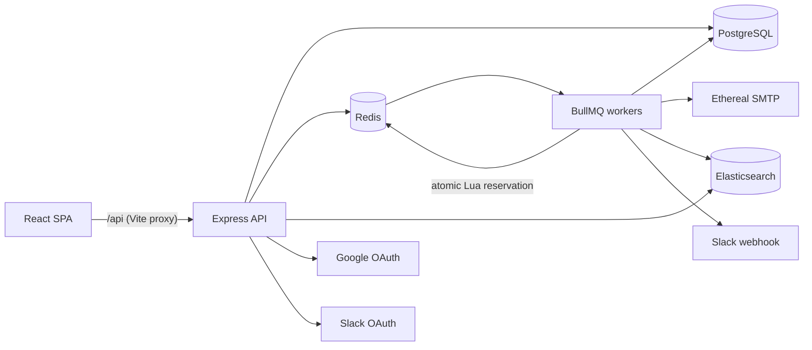

# Outbox Scheduler

A full-stack email scheduling platform inspired by ReachInbox, built for the Outbox Labs SDE Intern assignment.

Users sign in with Google, upload a CSV of leads and schedule a campaign. Each email becomes a BullMQ delayed job. A pool of workers sends the emails through Ethereal SMTP while enforcing a minimum gap between sends and rolling hourly limits per sender and per campaign. State is stored in PostgreSQL, so scheduled emails survive restarts and are never sent twice by the system. When a sender reaches its hourly limit, the affected emails are rescheduled and a Slack alert is posted.

---

## Table of contents

1. [Features implemented](#1-features-implemented)
2. [Tech stack](#2-tech-stack)
3. [Architecture overview](#3-architecture-overview)
4. [Project structure](#4-project-structure)
5. [Getting started](#5-getting-started)
6. [Environment variables](#6-environment-variables)
7. [Ethereal Email setup](#7-ethereal-email-setup)
8. [Google and Slack OAuth setup](#8-google-and-slack-oauth-setup)
9. [Running the backend](#9-running-the-backend)
10. [Running the frontend](#10-running-the-frontend)
11. [API overview](#11-api-overview)
12. [Testing](#12-testing)
13. [Design decisions and trade-offs](#13-design-decisions-and-trade-offs)
14. [Future improvements](#14-future-improvements)

---

## 1. Features implemented

### Backend

| Area | Implementation |
|---|---|
| **Scheduler** | Every email is a BullMQ delayed job (`jobId = emailId`, `delay = scheduledAt - now`). No cron, polling loop or in-memory timer is used. Send times are planned as `startAt + index × delay`. |
| **Persistence** | PostgreSQL is the source of truth for users, senders, campaigns, emails and a full event history. Redis runs with AOF persistence and `noeviction`, so queued jobs survive restarts. |
| **Restart recovery** | Stalled jobs are recovered by BullMQ, abandoned `processing` rows are reclaimed after the lock expires, and on startup the worker re-queues any pending email that has no live job. |
| **Rate limiting** | Rolling-window hourly limits per sender (`MAX_EMAILS_PER_HOUR_PER_SENDER`) and per campaign (hourly limit from the compose form), plus a minimum gap between sends (`MIN_SEND_DELAY_MS`). Enforced by one atomic Redis Lua script over sorted sets. |
| **Rescheduling** | Emails over a limit move to `rate_limited` and their jobs are delayed until capacity frees up. They are never dropped and keep campaign order. |
| **Concurrency** | Configurable `WORKER_CONCURRENCY`, any number of worker processes, and all shared decisions made atomically in Redis or PostgreSQL. |
| **Idempotency** | `Idempotency-Key` on campaign creation, one job per email ID, and a compare-and-set claim before every SMTP send. |
| **Retries** | Temporary SMTP failures retry with exponential backoff. Permanent failures (5xx, auth, rejected recipient) are marked `failed` immediately. |
| **Authentication** | Google OAuth 2.0 / OpenID Connect with PKCE, `state` and `nonce`, verified ID tokens, and server-side sessions in Redis (HttpOnly, Secure, SameSite=Lax cookies). |
| **Senders** | Multiple senders per user: one-click Ethereal accounts or any SMTP server. SMTP passwords are encrypted with AES-256-GCM. |
| **Lead parsing** | CSV/TXT upload or pasted text. Addresses are validated, normalised, de-duplicated and counted, with size and recipient limits. |
| **Slack alerts** | Slack OAuth (`incoming-webhook`) with encrypted token storage. At most one alert per sender or campaign per rolling window when a limit is reached. |
| **Search** | Emails are indexed asynchronously into Elasticsearch for full-text search with highlighting. |
| **Queue dashboard** | Bull Board at `/admin/queues`, restricted to emails listed in `ADMIN_EMAILS`. |
| **Operations** | Environment validation with zod, structured pino logs with request IDs and secret redaction, a central error handler, liveness and readiness endpoints, graceful shutdown, and Redis-backed API throttling. |

### Frontend

| Area | Implementation |
|---|---|
| **Login** | Google sign-in page with clear error messages for cancelled or failed logins. |
| **Dashboard layout** | Sidebar with the user's name, email and avatar, a Compose button, and Scheduled and Sent counts that refresh automatically. |
| **Scheduled / Sent tables** | Paginated lists showing recipient, status badge with time, subject and snippet. Sent rows link to the Ethereal preview. |
| **Search** | Search bar on both lists, powered by Elasticsearch with highlighted matches. |
| **Compose** | Sender picker, recipient upload or paste with "Detected N email addresses", subject, body, delay between emails, hourly limit, and send now or send later with presets. Client-side validation before submit. |
| **Email detail** | Full body, sender and recipient, planned and actual times, attempts, Ethereal preview link and a timeline of status events. |
| **Settings** | Manage senders (create Ethereal sender, add SMTP, send test, remove), connect or disconnect Slack, and open the queue dashboard for admins. |
| **UX states** | Loading skeletons, empty states, error states with retry, and toast notifications throughout. |

---

## 2. Tech stack

| Layer | Technology |
|---|---|
| Backend | Node.js 22, TypeScript, Express 5, zod, pino |
| Queue | BullMQ on Redis (ioredis) |
| Database | PostgreSQL 18 with Prisma 7 |
| Search | Elasticsearch 9 |
| Email | Nodemailer with Ethereal |
| Auth | Google OAuth (`google-auth-library`), Redis sessions |
| Queue UI | Bull Board |
| Frontend | React 19, Vite, Tailwind CSS 4, React Router, TanStack Query, lucide-react |
| Tests | Vitest, Supertest |
| Infrastructure | Docker Compose (PostgreSQL, Redis, Elasticsearch) |

---

## 3. Architecture overview



The system runs as two processes built from the same codebase:

- **API** (`backend/src/server.ts`): REST endpoints, OAuth, validation, persistence, enqueueing and Bull Board.
- **Worker** (`backend/src/worker.ts`): consumes three queues: `email-send`, `search-index` and `notifications`.

The guiding rule: **PostgreSQL records what happened to an email; BullMQ only decides when a worker looks at it.**

### How scheduling works

1. The client uploads leads to `POST /api/leads/parse` and receives a clean, de-duplicated list of addresses.
2. The client submits `POST /api/campaigns` with an `Idempotency-Key`. In a single transaction the API inserts the campaign, one `emails` row per recipient with its planned send time, and a `scheduled` event.
3. After the commit, the API adds one BullMQ delayed job per email in bulk, with `jobId = emailId`.
4. When a job becomes due, a worker loads the email. If it is already `sent` or `failed`, the job ends.
5. The worker runs the Lua reservation, which returns either a send slot or "limit reached":
   - **Future slot:** the job is moved back to delayed until that slot, freeing the worker.
   - **Limit reached:** the email becomes `rate_limited` and the job is delayed until the rolling window has room.
6. At its slot, the worker claims the email (`scheduled → processing`) and sends it over SMTP with a deterministic `Message-ID`.
7. The email becomes `sent`, `failed`, or `scheduled` with a retry. Each change writes an event and queues a search-index job.

Email status lifecycle:

```
scheduled    -> processing | rate_limited
rate_limited -> processing | scheduled
processing   -> sent | failed | scheduled (retry) | rate_limited
sent, failed -> final
```

Large campaigns (1000+ recipients) are accepted in one request and stored as individual delayed jobs. The workers then spread the sends according to the minimum gap and hourly limits.

### How persistence on restart is handled

| Event | Behaviour |
|---|---|
| API restart | No state lives in the API process. Sessions are in Redis and all business data is in PostgreSQL. |
| Worker restart or crash | Delayed and waiting jobs remain in Redis. A job that was active loses its lock and BullMQ's stalled-job check hands it to another worker. An email left in `processing` is reclaimed once its claim is older than `EMAIL_LOCK_DURATION_MS`. |
| Graceful shutdown | On SIGINT/SIGTERM, workers finish their active jobs before closing connections. |
| Redis restart | AOF (`appendfsync everysec`) restores the queues. |
| Lost jobs | On startup the worker reconciles PostgreSQL with BullMQ and re-queues every `scheduled`, `rate_limited` or `processing` email that has no live job, using its `next_attempt_at`. This covers a crash between the database commit and enqueueing, or a wiped Redis. |
| Docker restart | All services use `restart: unless-stopped` and named volumes. |

Duplicate sends are prevented by three layers:

1. **API:** the `Idempotency-Key` is unique per user. A repeated request returns the original campaign, and the same key with a different body returns 409.
2. **Queue:** `jobId = emailId`, so an email can only have one job.
3. **Database:** before sending, a worker claims the row with a compare-and-set update. Only one worker can win, and `sent` or `failed` rows are never processed again.

SMTP and PostgreSQL cannot commit atomically, so a crash in the instant after SMTP accepts a message but before it is marked `sent` can lead to one retry. The system accepts at-least-once delivery for this case, and the stable `Message-ID` lets receivers de-duplicate.

### How rate limiting and concurrency are implemented

**Minimum gap between sends.** Each sender has a `last_slot` in Redis. A new send is given `slot = max(now, last_slot + gap)`, where `gap` is the larger of `MIN_SEND_DELAY_MS` and the campaign's delay between emails. A job with a future slot waits in BullMQ's delayed set instead of sleeping, so it never occupies a worker.

**Rolling hourly limits.**

- A sender never has more than N reserved sends in any `RATE_LIMIT_WINDOW_MS` window (one hour by default), wherever that window starts.
- Reservations are stored in Redis sorted sets, one per sender and one per campaign (member = email ID, score = slot time). Because the email ID is the member, re-reserving an email never counts it twice.
- The sender limit applies across all of a sender's campaigns. The campaign limit applies to one campaign and cannot exceed the sender limit.
- The gap check, both limit checks and the reservation run as a single Lua script, which Redis executes atomically.
- When a limit is reached, nothing is written. The email becomes `rate_limited` and its job is delayed until the oldest counted send leaves the window, plus a small per-email offset that preserves campaign order.
- The window is counted with a small jitter margin (window + about 1 s at the default gap). Jobs can start slightly before or after their reserved slot, and the margin keeps the guarantee true for actual SMTP start times. The effective window is therefore marginally stricter than configured.

**Concurrency.**

- `WORKER_CONCURRENCY` sets parallel jobs per process, and any number of worker processes can run against the same queues.
- BullMQ hands each job to one worker at a time, renews its lock while it runs and re-queues stalled jobs.
- Everything shared between workers is atomic: slot reservation and limits (Lua), the email claim (compare-and-set in PostgreSQL), and Slack alert de-duplication (`SET NX`). No counters are kept in process memory.
- All of a sender's rate-limit keys share one Redis hash tag, so the script also works on Redis Cluster.

**Slack alerts.** The first job to hit a limit claims a `SET NX` key that expires after one window and queues a `notifications` job. The notification worker looks up the user's Slack connection at send time; if Slack is not connected, the alert is skipped. Email delivery never waits on Slack.

**Search.** Elasticsearch is a derived copy. Index jobs read the current row from PostgreSQL and write it with a version number, so stale updates are ignored. If Elasticsearch is unavailable, delivery and the dashboard lists continue to work, and the index can be rebuilt with `npm run search:reindex`.

---

## 4. Project structure

```
OUTBOX-project/
  docker-compose.yml
  backend/
    prisma/                 schema and migrations
    scripts/                migrations, reindex, Google OAuth check
    src/
      config/               environment validation
      infra/                Prisma, Redis, Elasticsearch, logger, mailer clients
      middleware/           auth, origin check, rate limiting, errors, logging
      modules/
        auth/               Google OAuth and sessions
        campaigns/          scheduling API and planning
        delivery/           Lua limiter, send processor, SMTP, reconciliation
        emails/             lists, detail, statuses
        leads/              CSV/text parsing
        search/             Elasticsearch index and search API
        senders/            SMTP and Ethereal senders
        slack/              Slack OAuth and alerts
        admin/              Bull Board and queue summary
        health/             liveness and readiness
      queues/               queue definitions and producers
      app.ts
      server.ts             API entry point
      worker.ts             worker entry point
    tests/
  frontend/
    src/
      components/           UI kit, email rows, compose, layout
      context/              auth and toasts
      hooks/                data queries
      layouts/
      lib/                  API client, formatting
      pages/                login, emails, compose, detail, settings
      services/             typed API calls
      types/                API contracts
```

---

## 5. Getting started

### Prerequisites

- Node.js 22.12 or newer
- Docker Desktop with Docker Compose v2
- A Google Cloud project (for OAuth)
- A Slack workspace where apps can be installed (optional)

### Setup

```bash
git clone https://github.com/Shashank-sys-ux/Outbox-project.git
cd Outbox-project

docker compose up -d

cd backend
npm install
cp .env.example .env
npm run db:deploy

cd ../frontend
npm install
```

`docker compose up -d` starts PostgreSQL, Redis and Elasticsearch, bound to `127.0.0.1` with healthchecks and persistent volumes. `npm install` in `backend/` also generates the Prisma client.

Generate the two required secrets and add them to `backend/.env`:

```bash
node -e "console.log(require('crypto').randomBytes(48).toString('base64url'))"
node -e "console.log(require('crypto').randomBytes(32).toString('base64'))"
```

The first value is `SESSION_SECRET` and the second is `ENCRYPTION_KEY`.

---

## 6. Environment variables

All backend settings live in `backend/.env` and are validated at startup. A missing or invalid value stops the process with a message naming the variable.

| Variable | Default | Purpose |
|---|---|---|
| `APP_URL` | `https://localhost:5173` | Public origin of the frontend |
| `PORT` | `4000` | API port |
| `DATABASE_URL` | required | PostgreSQL connection string |
| `REDIS_URL` | required | Redis connection string |
| `ELASTICSEARCH_URL` | required | Elasticsearch URL |
| `SESSION_SECRET` | required | Session key derivation secret (32+ characters) |
| `ENCRYPTION_KEY` | required | 32-byte base64 key for encrypting SMTP passwords and Slack tokens |
| `GOOGLE_CLIENT_ID`, `GOOGLE_CLIENT_SECRET` | empty | Google OAuth client |
| `GOOGLE_CALLBACK_URL` | `APP_URL/api/auth/google/callback` | Google redirect URI |
| `SLACK_CLIENT_ID`, `SLACK_CLIENT_SECRET` | empty | Slack app credentials |
| `SLACK_REDIRECT_URI` | `APP_URL/api/slack/callback` | Slack redirect URI (must be https) |
| `ETHEREAL_USER`, `ETHEREAL_PASSWORD` | empty | Optional default Ethereal sender for new users |
| `ADMIN_EMAILS` | empty | Comma-separated emails allowed to open Bull Board |
| `WORKER_CONCURRENCY` | `5` | Parallel jobs per worker process |
| `MIN_SEND_DELAY_MS` | `2000` | Minimum gap between two sends from the same sender |
| `MAX_EMAILS_PER_HOUR_PER_SENDER` | `200` | Sender limit per rolling window, and the maximum campaign limit |
| `RATE_LIMIT_WINDOW_MS` | `3600000` | Rolling window length (use `60000` for quick local testing) |
| `EMAIL_MAX_ATTEMPTS`, `EMAIL_RETRY_BACKOFF_MS` | `5`, `30000` | Retry policy for temporary SMTP failures |
| `EMAIL_LOCK_DURATION_MS` | `30000` | Job lock, and the age after which a `processing` claim is treated as abandoned |
| `UPLOAD_MAX_BYTES`, `MAX_RECIPIENTS_PER_CAMPAIGN` | 5 MB, `10000` | Upload and campaign size limits |

The full list with every default is in `backend/.env.example`. The root `.env.example` only overrides Docker ports and passwords.

---

## 7. Ethereal Email setup

[Ethereal](https://ethereal.email) is a fake SMTP service for testing. It accepts messages but never delivers them to real inboxes; each message can be viewed through a preview URL.

No manual setup is required:

- **Settings → Ethereal sender** (or the button on the Compose page) creates a new Ethereal account through `nodemailer.createTestAccount()` and saves it as a sender.
- Every sent email stores its Ethereal preview URL, shown on the Sent list and the email detail page.

To use a fixed Ethereal account instead, create one at https://ethereal.email and set `ETHEREAL_USER` and `ETHEREAL_PASSWORD` in `backend/.env`. New users then receive it as their default sender on first login.

Any real SMTP server can also be added under **Settings → Add SMTP**; the credentials are verified before they are saved.

---

## 8. Google and Slack OAuth setup

### Google

1. In Google Cloud Console, configure the OAuth consent screen (External) and add test users if it is in Testing mode.
2. Create an OAuth client of type **Web application** with:
   - Authorized JavaScript origin: `https://localhost:5173`
   - Authorized redirect URI: `https://localhost:5173/api/auth/google/callback`
3. Set `GOOGLE_CLIENT_ID` and `GOOGLE_CLIENT_SECRET` in `backend/.env`.
4. Run `npm run auth:check-google` in `backend/` to confirm Google accepts the client ID, secret and redirect URI.

### Slack (optional)

1. Create an app at https://api.slack.com/apps.
2. Under **OAuth & Permissions**, add the redirect URL `https://localhost:5173/api/slack/callback` and the `incoming-webhook` scope.
3. Set `SLACK_CLIENT_ID` and `SLACK_CLIENT_SECRET` in `backend/.env`.
4. In the app, open **Settings → Connect Slack** and choose a channel.

Slack requires an https redirect URL. If `https://localhost` is rejected, expose the API through a tunnel such as ngrok and set `SLACK_REDIRECT_URI` to the tunnel URL.

---

## 9. Running the backend

With Docker services running and `backend/.env` configured, start the API and the worker in separate terminals:

```bash
cd backend
npm run dev
```

```bash
cd backend
npm run dev:worker
```

- The API listens on `http://localhost:4000`. It exits if PostgreSQL or Redis is unreachable, and starts in degraded mode if only Elasticsearch is down.
- The worker processes the `email-send`, `search-index` and `notifications` queues. Before consuming jobs, it reconciles pending emails in PostgreSQL with BullMQ.
- Additional workers can be started with the same command.
- Both processes restart automatically when source files or `.env` change.

Health endpoints:

- `GET /api/health`: liveness
- `GET /api/health/ready`: readiness (503 if PostgreSQL or Redis is down, `degraded` if only Elasticsearch is down)

Production build:

```bash
npm run build
npm start
npm run start:worker
```

Other scripts:

| Script | Purpose |
|---|---|
| `npm run db:deploy` | Apply database migrations |
| `npm run db:migrate -- <name>` | Create and apply a new migration |
| `npm run db:studio` | Browse the database |
| `npm run search:reindex` | Rebuild the Elasticsearch index from PostgreSQL |
| `npm run auth:check-google` | Validate the Google OAuth configuration |

The queue dashboard is available at https://localhost:5173/admin/queues for users listed in `ADMIN_EMAILS`.

---

## 10. Running the frontend

```bash
cd frontend
npm run dev
```

Open https://localhost:5173 and accept the self-signed development certificate once. HTTPS is used because Slack only accepts https redirect URLs.

Vite proxies `/api` and `/admin` to `http://localhost:4000`, so the browser talks to a single origin and session cookies work without CORS configuration.

Production build:

```bash
npm run build
```

---

## 11. API overview

All endpoints are under `/api`. Apart from health, config and the OAuth redirects, they require the session cookie. Successful responses use `{ "data": ... }` and errors use `{ "error": { "code", "message", "details?", "requestId" } }`.

| Method | Endpoint | Purpose |
|---|---|---|
| GET | `/api/auth/google` | Start Google login |
| GET | `/api/auth/me` | Current user |
| POST | `/api/auth/logout` | End the session |
| GET, POST | `/api/senders` | List or add senders |
| POST | `/api/senders/ethereal` | Create an Ethereal sender |
| POST | `/api/leads/parse` | Parse a CSV/TXT upload or pasted text into valid emails |
| POST | `/api/campaigns` | Schedule a campaign (requires `Idempotency-Key`) |
| GET | `/api/campaigns` | List campaigns with per-status counts |
| GET | `/api/emails?view=scheduled\|sent` | Paginated scheduled or sent emails |
| GET | `/api/emails/:id` | Email detail with event history |
| GET | `/api/search/emails` | Full-text search over the user's emails |
| GET | `/api/slack/install` | Start the Slack OAuth flow |
| GET | `/api/slack/status` | Slack connection status |
| GET | `/api/admin/queues/summary` | Job counts per queue (admin only) |

Route definitions are in `backend/src/modules/*/*.routes.ts`.

---

## 12. Testing

```bash
cd backend
npm test
npm run typecheck

cd ../frontend
npm run build
```

The backend suite contains 124 tests. Redis-backed tests use database 15 and clear it between runs.

| Area | Coverage |
|---|---|
| Rate limiter (real Redis) | Minimum gap spacing, sender and campaign limits, rolling-window behaviour across a clock boundary, randomized timing from two concurrent clients, jitter margin, no double counting, backlog deferral, key expiry, alert de-duplication |
| Delivery processor | Successful send, skipping finished emails, a single send when two workers race, delayed slots, rate-limit rescheduling with ordering and one alert, transient and permanent SMTP failures, abandoned claim recovery |
| Scheduling and parsing | Send-time planning, recipient normalisation, start-time rules, idempotency hashing, CSV and text parsing, duplicates, invalid addresses, large inputs |
| State machine | Allowed and rejected status transitions |
| Security | Protected routes, forged cookies, cross-origin blocking, Bull Board access, security headers, session storage |
| Foundation | Environment validation, AES-GCM encryption, PKCE, error handling, log redaction, health checks |

---

## 13. Design decisions and trade-offs

| Decision | Alternative | Reason |
|---|---|---|
| Separate API and worker processes | Process jobs inside the API | Independent scaling and restarts; slow SMTP cannot block HTTP requests |
| PostgreSQL as source of truth, BullMQ for timing | Store state only in Redis | Durable, constrained business state; jobs can always be rebuilt from the database |
| BullMQ delayed jobs | Cron or polling | Precise timing without scanning the database; survives restarts with Redis persistence |
| Atomic Lua slot reservation | BullMQ limiter or `sleep` | Per-sender limits across processes without blocking worker slots |
| Rolling window with sorted sets | Fixed clock windows | Guarantees no more than N sends in any window; fixed windows allow up to 2× the limit around a boundary |
| Jitter margin on the window | Exact window | Keeps the guarantee for real SMTP start times at the cost of a slightly stricter limit |
| At-least-once delivery for the crash window | At-most-once | Losing an email is worse than a rare duplicate; a stable `Message-ID` allows de-duplication |
| Redis server-side sessions | JWT in the browser | Real logout and revocation; no tokens exposed to JavaScript |
| Asynchronous search indexing | Synchronous indexing | Elasticsearch outages never affect delivery |
| Vite proxy with a single origin | Cross-origin API with CORS | Simpler cookies and configuration |

Assumptions:

- A sender is an SMTP identity owned by one user; its hourly limit applies across all of its campaigns.
- Email bodies are plain text and are converted to escaped HTML for sending.
- Times are stored in UTC and displayed in the browser's time zone.
- Google is the only login provider. Slack is an integration.

---

## 14. Future improvements

- Containerize the API and worker, with CI
- Add pause, resume and cancel controls for campaigns
- Add end-to-end Playwright tests and production metrics
