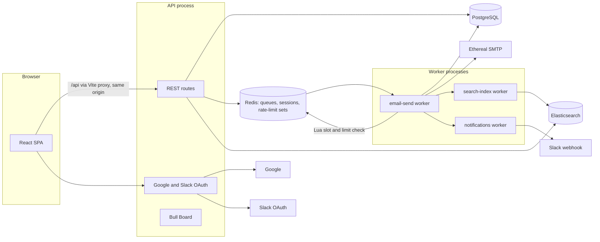

# Outbox Scheduler

A full-stack email scheduling system inspired by ReachInbox, built for the Outbox Labs SDE Intern assignment.

You sign in with Google, upload a CSV of leads and schedule a campaign. A pool of BullMQ workers then sends the emails through Ethereal SMTP. Sending respects a per-sender minimum gap and hourly limits, both coordinated through Redis. Everything survives restarts, no email is sent twice by the system, and a Slack message is posted when a sender hits its hourly limit.

---

## 1. Project overview

| Piece | Responsibility |
|---|---|
| React SPA (`frontend/`) | Login, dashboard, compose, CSV upload, search, settings |
| API process (`backend/src/server.ts`) | REST API, Google/Slack OAuth, validation, persistence, enqueueing, Bull Board |
| Worker process (`backend/src/worker.ts`) | Consumes BullMQ jobs, enforces pacing and limits, sends over SMTP, indexes into Elasticsearch, posts Slack alerts |
| PostgreSQL | Source of truth for users, senders, campaigns, emails and their history |
| Redis | BullMQ queues, sessions, OAuth state, rolling-window rate-limit sorted sets, send slots |
| Elasticsearch | Full-text search over scheduled and sent emails (derived data) |

The core rule: **Postgres decides what happened to an email, BullMQ only decides when a worker looks at it.**

## 2. Features

- Real Google OAuth 2.0 / OpenID Connect login (authorization code, PKCE S256, `state`, `nonce`, verified ID token)
- Server-side sessions in Redis with HttpOnly, Secure, SameSite=Lax cookies; logout revokes the session
- Multiple senders per user: one-click Ethereal test accounts or any SMTP server (password encrypted with AES-256-GCM)
- CSV/TXT upload or pasted text; emails are detected, validated, de-duplicated, and counted as "Detected X email addresses"
- Campaign scheduling with start time, delay between emails and hourly limit; `Idempotency-Key` protects against double submits
- BullMQ delayed jobs, one per email (`jobId = emailId`), with retries, exponential backoff, cleanup policy and configurable concurrency
- Minimum gap between sends, plus rolling-window hourly limits per sender and per campaign, enforced by one atomic Redis Lua script over sorted sets across any number of workers
- Rate-limited emails are rescheduled to the moment the oldest counted send leaves the rolling window, never dropped, and keep their order
- Real Slack OAuth (`incoming-webhook`), encrypted token storage, connect, test, reconnect, disconnect, and at most one alert per sender or campaign per rolling window
- Elasticsearch index with a custom email analyzer, asynchronous versioned indexing, search API and a search box in the UI
- Bull Board at `/admin/queues`, restricted to emails listed in `ADMIN_EMAILS`
- Restart safety: AOF-persisted Redis, compare-and-set claims, stalled-job recovery, and startup reconciliation
- Structured pino logs with request IDs and redaction; central error handler with a single error shape
- Loading, empty and error states, plus toasts, across the UI

## 3. Architecture



Life of one email:

1. `POST /api/leads/parse` turns a CSV into a clean list of addresses.
2. `POST /api/campaigns` with an `Idempotency-Key` validates the request. In one transaction it inserts the campaign, one `emails` row per recipient (`scheduled_at = startAt + i × delay`) and a `scheduled` event.
3. After the commit, the API calls `addBulk` with one delayed job per email: `jobId = emailId` and `delay = scheduled_at - now`.
4. When a job becomes due, a worker loads the row. If it is already `sent` or `failed`, the job ends.
5. The worker runs the atomic Lua reservation (`RESERVE_SEND_SLOT_LUA`, registered as the ioredis command `outboxReserveSendSlot`). The script either reserves the next free slot for the sender, or reports that the sender's or campaign's rolling window already holds its limit.
6. If the slot is in the future, the job moves back to delayed until that slot. If a limit is reached, the row becomes `rate_limited` and the job is delayed until the oldest counted send leaves the rolling window.
7. Otherwise the worker claims the row (`scheduled/rate_limited → processing`, compare-and-set) and sends over SMTP with a deterministic `Message-ID`.
8. The row becomes `sent`, or `scheduled` with a retry, or `failed`. An event is written in the same transaction, and a search-index job is queued.

## 4. Tech stack

| Layer | Choice |
|---|---|
| Backend | Node.js 22, TypeScript 6, Express 5, zod, pino |
| Queue | BullMQ 6 on ioredis 5.11 |
| Database | PostgreSQL 18 via Prisma 7 (driver adapter `@prisma/adapter-pg`) |
| Search | Elasticsearch 9.5 with `@elastic/elasticsearch` 9 |
| Email | Nodemailer 10 with Ethereal |
| Auth | `google-auth-library` (ID token verification), own Redis session store |
| Queue UI | Bull Board 9 |
| Frontend | React 19, Vite 8, Tailwind CSS 4, React Router 7, TanStack Query 5, lucide-react |
| Tests | Vitest 5, Supertest |
| Infra | Docker Compose (Postgres, Redis with AOF, Elasticsearch single node) |

TypeScript 6 is used instead of 7 because 7 removed the JavaScript compiler API that some tooling still needs.

## 5. Folder structure

```
OUTBOX-project/
  docker-compose.yml
  .env.example
  README.md
  backend/
    prisma/
      schema.prisma
      migrations/
    prisma.config.ts
    scripts/
      db-migrate.ts
      search-reindex.ts
    src/
      config/env.ts
      infra/
      middleware/
      modules/
        admin/
        auth/
        campaigns/
        delivery/
        emails/
        health/
        leads/
        search/
        senders/
        slack/
      queues/
      types/
      utils/
      app.ts
      server.ts
      worker.ts
    tests/
  frontend/
    src/
      components/
        auth/
        compose/
        email/
        layout/
        ui/
      context/
      hooks/
      layouts/
      lib/
      pages/
      services/
      types/
      App.tsx
      main.tsx
```

The backend is organised by feature. Each module owns its routes, service and schema. Shared clients (Prisma, Redis, Elasticsearch, the logger, the mailer) live in `infra/`.

## 6. Prerequisites

- Node.js 22.12 or newer
- Docker Desktop with Docker Compose v2
- A Google Cloud project for OAuth credentials
- A Slack workspace where you can install apps (optional; alerts are skipped without it)

## 7. Installation

```bash
git clone https://github.com/Shashank-sys-ux/Outbox-project.git
cd Outbox-project
docker compose up -d
cd backend
npm install
cp .env.example .env
npm run db:deploy
cd ../frontend
npm install
```

`npm install` in `backend/` also runs `prisma generate` through `postinstall`.

Generate the two secrets and paste them into `backend/.env`:

```bash
node -e "console.log(require('crypto').randomBytes(48).toString('base64url'))"
node -e "console.log(require('crypto').randomBytes(32).toString('base64'))"
```

The first is `SESSION_SECRET` and the second is `ENCRYPTION_KEY`.

## 8. Environment variables

All backend configuration is validated with zod at startup. If a value is missing or invalid, the process refuses to start and names the variable.

| Variable | Default | Purpose |
|---|---|---|
| `APP_URL` | `https://localhost:5173` | Public origin of the SPA; OAuth redirects and the CSRF origin check use it |
| `PORT` | `4000` | API port |
| `DATABASE_URL` | required | Postgres connection string |
| `DATABASE_POOL_MAX` | `10` | pg pool size per process |
| `REDIS_URL` | required | Redis connection string |
| `ELASTICSEARCH_URL` / `ELASTICSEARCH_INDEX` | required / `outbox-emails` | Search cluster and index name |
| `SESSION_SECRET` | required | HMAC key used to derive Redis session keys (at least 32 characters) |
| `SESSION_TTL_SECONDS` | `604800` | Session lifetime |
| `COOKIE_SECURE` | `true` | Secure flag on cookies |
| `ENCRYPTION_KEY` | required | 32-byte base64 key for AES-256-GCM (SMTP passwords, Slack tokens) |
| `GOOGLE_CLIENT_ID` / `GOOGLE_CLIENT_SECRET` / `GOOGLE_CALLBACK_URL` | empty | Google OAuth client |
| `SLACK_CLIENT_ID` / `SLACK_CLIENT_SECRET` / `SLACK_REDIRECT_URI` | empty | Slack OAuth app; the redirect must be https |
| `ETHEREAL_HOST` / `ETHEREAL_PORT` / `ETHEREAL_USER` / `ETHEREAL_PASSWORD` | Ethereal defaults | If a user and password are set, each new user gets them as a default sender |
| `ADMIN_EMAILS` | empty | Comma-separated emails allowed to open Bull Board |
| `BULL_BOARD_READ_ONLY` | `false` | Hide retry and delete actions in Bull Board |
| `WORKER_CONCURRENCY` | `5` | Jobs processed in parallel per worker process |
| `MIN_SEND_DELAY_MS` | `2000` | Minimum gap between two sends of the same sender |
| `MAX_EMAILS_PER_HOUR_PER_SENDER` | `200` | Sender limit per rolling window; also the maximum campaign hourly limit |
| `RATE_LIMIT_WINDOW_MS` | `3600000` | Length of the rolling rate-limit window. Keep 1 hour for real use; set `60000` for a quick demo |
| `EMAIL_MAX_ATTEMPTS` / `EMAIL_RETRY_BACKOFF_MS` | `5` / `30000` | Retries for temporary SMTP failures, with exponential backoff |
| `EMAIL_LOCK_DURATION_MS` | `30000` | BullMQ job lock; also the age after which a `processing` claim counts as abandoned |
| `SMTP_TIMEOUT_MS` | `20000` | Connection, greeting and socket timeouts |
| `UPLOAD_MAX_BYTES` / `MAX_RECIPIENTS_PER_CAMPAIGN` | 5 MB / `10000` | Upload and campaign size limits |
| `API_RATE_LIMIT_PER_MINUTE` / `AUTH_RATE_LIMIT_PER_MINUTE` | `300` / `30` | Redis-backed API throttling |

The root `.env.example` only overrides Docker ports and passwords. The optional `frontend/.env.example` holds `BACKEND_URL` and `DEV_HTTPS`.

## 9. Docker setup

```bash
docker compose up -d
docker compose ps
```

All three services have healthchecks and `restart: unless-stopped`. Ports are bound to `127.0.0.1` only. Data lives in named volumes (`pgdata`, `redisdata`, `esdata`):

- `docker compose down` keeps your data.
- `docker compose down -v` wipes it.

The API, worker and frontend run on the host with `npm` for fast reloads.

## 10. Database setup

```bash
cd backend
npm run db:deploy
npm run db:status
```

Six tables:

| Table | Holds |
|---|---|
| `users` | Google identity, keyed by `google_sub` |
| `senders` | SMTP settings with the password encrypted; unique per user and email |
| `campaigns` | Subject, body, schedule settings, `idempotency_key` and `request_hash`; unique per user and key |
| `emails` | One row per recipient: status, `scheduled_at`, `next_attempt_at`, attempts, `claimed_at`, `completed_at`, message ID, preview URL; unique per campaign and recipient |
| `email_events` | Append-only history of every state change |
| `slack_connections` | Team, channel, encrypted webhook URL and access token, one per user |

`emails.user_id` and `emails.sender_id` are copied from the campaign so dashboard and limiter queries need no join. These values never change after insert.

Indexes cover the Scheduled tab (`user_id, status, next_attempt_at`), the Sent tab (`user_id, status, completed_at desc`) and reconciliation (`status, next_attempt_at`). Primary keys are UUID v7, so inserts are time-ordered.

To create a new migration, run `npm run db:migrate -- <name>`. The script also strips Prisma's auto-generated comments before applying the migration.

## 11. Redis setup

Redis runs with:

- `--appendonly yes --appendfsync everysec`: delayed jobs survive a restart, with at most about 1 second of writes at risk.
- `--maxmemory-policy noeviction`: Redis never silently deletes queue keys.

Redis stores BullMQ jobs, sessions, send slots and rolling-window rate-limit state. Atomic Lua reservations make rate limiting safe across workers.

## 12. Elasticsearch setup

A single node runs with security disabled. This is acceptable only because it is bound to localhost. The index is created automatically by the API and the worker on startup, using the mapping in `backend/src/modules/search/email-search.index.ts`.

To rebuild the index from Postgres at any time:

```bash
cd backend
npm run search:reindex
```

## 13. Google OAuth setup

1. In Google Cloud Console, open **APIs & Services → OAuth consent screen**. Choose External and add yourself as a test user.
2. Open **Credentials → Create credentials → OAuth client ID → Web application**.
3. Add the authorized JavaScript origin `https://localhost:5173`.
4. Add the authorized redirect URI `https://localhost:5173/api/auth/google/callback`.
5. Put the client ID and secret into `backend/.env` and save the file.
6. Add your Google email to `ADMIN_EMAILS` if you want Bull Board access.
7. Run `npm run auth:check-google` in `backend/`. It asks Google whether the client ID, secret and redirect URI are accepted, without needing a login, and prints a fix for each problem. For example, `redirect_uri_mismatch` means the URI from step 4 is missing.

`npm run dev` and `npm run dev:worker` restart automatically when `.env` is saved.

The callback goes through the Vite proxy, so the session cookie is set on the same origin as the SPA.

## 14. Slack OAuth setup

1. Create an app at https://api.slack.com/apps, choosing **From scratch**.
2. Under **OAuth & Permissions**, add the redirect URL `https://localhost:5173/api/slack/callback` and the bot scope `incoming-webhook`.
3. Copy the client ID and client secret from **Basic Information** into `backend/.env`.
4. In the app, open **Settings → Connect Slack**, approve, and pick a channel.

Slack only accepts https redirect URLs. The dev server runs on https for this reason.

If Slack rejects `https://localhost` in your workspace, expose the API with a tunnel:

- Run `ngrok http 4000`.
- Set `SLACK_REDIRECT_URI=https://<id>.ngrok-free.app/api/slack/callback` and register the same URL in Slack.

The callback does not need the browser cookie: the one-time `state` stored in Redis identifies the user. After the callback, the browser is redirected back to `APP_URL`.

## 15. Ethereal setup

Nothing is required. **Settings → Ethereal sender** (or the button in Compose) calls `nodemailer.createTestAccount()` and saves the account as a sender. Every sent email gets a preview link, shown in the email detail page and in the Sent list.

To reuse your own account, create one at https://ethereal.email and set `ETHEREAL_USER` and `ETHEREAL_PASSWORD`. New users then get it as a default sender at first login.

## 16. Backend startup

```bash
cd backend
npm run dev
```

On startup the API checks Postgres and Redis and exits if either is unreachable. It warns, but keeps running, if Elasticsearch is down or OAuth is not configured.

- `GET /api/health` is liveness.
- `GET /api/health/ready` is readiness. It returns 503 if Postgres or Redis is down and `degraded` if only Elasticsearch is down.

## 17. Worker startup

```bash
cd backend
npm run dev:worker
```

Start the same command in more terminals to run multiple workers. Each process uses `WORKER_CONCURRENCY` slots. Before it starts consuming, the worker reconciles Postgres with BullMQ.

For production:

```bash
npm run build
npm start
npm run start:worker
```

## 18. Frontend startup

```bash
cd frontend
npm run dev
```

Open https://localhost:5173 and accept the self-signed certificate once. Vite proxies `/api` and `/admin` to `http://localhost:4000`, so the browser only ever talks to one origin. There is no CORS setup and cookies just work.

## 19. API overview

All endpoints are under `/api` and, apart from health, config and the OAuth redirects, require the session cookie. Success responses are `{ "data": ... }`; errors are `{ "error": { "code", "message", "details?", "requestId" } }`.

Key endpoints:

- `POST /api/leads/parse`: parse an uploaded CSV/TXT or pasted text into valid, de-duplicated emails
- `POST /api/campaigns`: schedule a campaign (requires an `Idempotency-Key` header)
- `GET /api/campaigns`: list campaigns with per-status counts
- `GET /api/emails`: scheduled or sent emails (`view=scheduled|sent`), paginated
- `GET /api/search/emails`: Elasticsearch search over the user's emails
- `GET /api/slack/install`: start the Slack OAuth flow
- `GET /api/slack/status`: Slack connection status
- `GET /api/admin/queues/summary`: job counts per queue (admin only)

The route definitions live in `backend/src/modules/*/*.routes.ts`.

## 20. Scheduling architecture

There is no cron, no polling loop and no in-memory timer. Every future action is a BullMQ delayed job stored in a Redis sorted set:

- the first attempt
- waiting for a send slot
- waiting for room in the rolling rate-limit window
- a retry backoff

The job payload only carries `emailId` and, while waiting for a slot, the reserved slot. All business state lives in Postgres.

Email statuses:

```
scheduled    -> processing | rate_limited
rate_limited -> processing | scheduled
processing   -> sent | failed | scheduled (retry) | rate_limited
sent, failed -> final
```

The Scheduled tab shows `scheduled`, `processing` and `rate_limited`. The Sent tab shows `sent` and `failed`.

### 1000+ emails

1000+ emails are accepted as individual delayed jobs. Worker concurrency and Redis-backed scheduling spread the sends according to the configured minimum delay and hourly limits. Emails that exceed a limit are rescheduled rather than dropped.

Measured locally: 1000 recipients were accepted in about 1 second and 1000 delayed jobs were created. A double submit returned 200 without adding any jobs.

## 21. Persistence and restart behaviour

- **API restart:** state is in Postgres and Redis, so nothing is lost. Sessions survive too.
- **Worker restart or crash:**
  - Delayed and waiting jobs stay in Redis.
  - A job that was active when the process died loses its lock. BullMQ's stalled-job checker hands it to another worker.
  - The row may still say `processing`. It is reclaimed once `claimed_at` is older than `EMAIL_LOCK_DURATION_MS`.
- **Graceful shutdown:** on SIGINT/SIGTERM the worker calls `worker.close()`, which lets active jobs finish, then closes connections.
- **Redis restart:** AOF restores the queues. If jobs are lost anyway (for example a wiped Redis, or a crash between the database commit and `addBulk`), startup reconciliation re-adds a job for every `scheduled`, `rate_limited` or `processing` row that has no live job. The delay comes from `next_attempt_at`.
- **Docker restart:** all services have `restart: unless-stopped` and named volumes.

Verified locally:

- Two emails were scheduled 40 s ahead.
- The worker was killed and Redis was restarted.
- The two delayed jobs were still there after the Redis restart.
- The worker was started again, and both emails went out on time, exactly once (one `sent` event each).
- Separately, jobs deleted from Redis by hand were re-queued by reconciliation (`requeued: 2`) and delivered.

## 22. Idempotency strategy

Three layers:

1. **API:** `Idempotency-Key` is unique per user. A repeat with the same body returns the original campaign. A repeat with a different body returns 409. The body is compared through a SHA-256 hash stored on the campaign. A race between two identical requests is resolved by the unique index.
2. **Queue:** `jobId = emailId`, so BullMQ ignores a second job for the same email.
3. **Database:** before sending, a worker claims the row:

   ```
   UPDATE emails SET status = 'processing', claimed_at = now()
   WHERE id = $1 AND (status IN ('scheduled', 'rate_limited') OR claimed_at < now() - lock)
   ```

   Only one worker can win. The loser re-reads the row and either stops (if the email is finished) or rechecks later. Sent and failed rows are never touched again. A test runs two processors on the same email at once and asserts a single SMTP send.

**Remaining window.** SMTP and Postgres cannot commit atomically. If a process dies after the SMTP server accepted the email but before the `sent` update, the retry cannot know the email went out. The system chooses at-least-once delivery for this rare window. Every attempt uses the same `Message-ID` (`<emailId@outbox.local>`), so receiving systems can de-duplicate.

## 23. Concurrency strategy

- `WORKER_CONCURRENCY` controls parallel jobs per process. You can run as many worker processes as you like.
- BullMQ gives each job to exactly one worker, holds a lock that is renewed while the job runs, and re-queues stalled jobs (`maxStalledCount: 2`).
- Everything that must be shared across workers is atomic in Redis or Postgres:
  - the send slot and the rolling-window sorted sets (one Lua script run as a single command)
  - the claim (compare-and-set update)
  - Slack de-duplication (`SET NX`)

  No process keeps counters in memory.
- **Multi-worker safety:**
  - Redis runs each Lua script to completion before any other command. Two workers, or two jobs in one worker, therefore cannot both read "2 of 3 used" and both reserve.
  - All of a sender's keys share the `{s:<senderId>}` hash tag, so the script still works on Redis Cluster.
  - Tests cover this with two separate Redis connections: 120 simultaneous reservations grant exactly the limit, and a randomized two-client run never puts more than N slots in any rolling window.
  - A live two-worker drill was run earlier on the previous fixed-window implementation. It has not been repeated since the switch to the rolling window.

## 24. Minimum send delay strategy

- Each sender has a `last_slot` in Redis. A new send gets `slot = max(now, last_slot + gap)`, where `gap` is the larger of `MIN_SEND_DELAY_MS` and the campaign's "delay between emails".
- A job whose slot is in the future is moved back to BullMQ's delayed set until that slot, so it never holds a worker while waiting.
- Why not `sleep()`? A sleeping job blocks a concurrency slot, and separate processes would sleep independently and send at the same moment.
- Why not BullMQ's built-in limiter? It is queue-wide, and per-group limits are a BullMQ Pro feature.

## 25. Hourly rate-limit strategy

- **Rolling window:** a sender never has more than N reserved sends in any `RATE_LIMIT_WINDOW_MS` window (one hour by default), whenever that window starts. It is not aligned to clock hours.
- **Redis sorted sets:** one per sender and one per campaign, holding each reserved send (member = email ID, score = slot time). Using the email ID as the member means a re-reservation is never counted twice.
- **Atomic Lua:** the minimum-gap check, both limit checks and the reservation run as one Lua script. Redis executes it as a single command.
- **Sender and campaign limits:** `MAX_EMAILS_PER_HOUR_PER_SENDER` applies across all of a sender's campaigns. The compose form's hourly limit applies per campaign, capped at the sender limit.
- **Rescheduling:** when a limit is reached, the email becomes `rate_limited` and its BullMQ job is delayed until the oldest counted send leaves the window. It is never dropped, and waiting emails resume in campaign order.
- **Multi-worker safety:** because the check and the reservation are one atomic script, any number of workers and jobs can run at once without exceeding a limit. All of a sender's keys share one hash tag, so this also holds on Redis Cluster.
- **Jitter margin:** jobs can start a few milliseconds before or up to about a second after their reserved slot. The script therefore counts over the window plus a small margin (1025 ms with the default 2 s gap), so the guarantee holds for actual SMTP start times. The effective window is slightly stricter as a result: about 1.7% at a 60 s window and about 0.03% at one hour.
- **Why a rolling window:** fixed clock windows are simpler, but they allow up to 2× the limit around a boundary. In testing that showed up as 4 sends in 6 seconds with a limit of 3.

The implementation is in `backend/src/modules/delivery/send-slot-limiter.ts`, and its behaviour is covered by `backend/tests/delivery/send-slot-limiter.test.ts`.

## 26. Slack notification behaviour

- **When:** only when the reservation script reports `sender_limit` or `campaign_limit`. A `backlog` deferral never alerts.
  - The first job to hit the limit wins `SET NX` on `rl:{s:<senderId>}:alerted:<scope>:<scopeId>`, which expires after one window (`RATE_LIMIT_WINDOW_MS`). So there is at most one alert per sender (or per campaign) in any rolling window, however many emails are limited and however many workers run.
  - The winner queues a `notifications` job with the deterministic `jobId` `rate-limit.<scope>.<id>.<windowStart>`, a second guard against duplicates.
  - The message states the limit, the rolling window (from the oldest counted send to the moment room frees up) and when the remaining emails resume.
- **Sending:** the notification worker looks up the user's Slack connection at send time. Connecting Slack later therefore works without a redeploy.
  - If Slack is not connected, the job completes as `not_connected`.
  - Permanent 4xx webhook errors are not retried. Network errors and 5xx responses retry with backoff.
  - Email delivery never waits on Slack.
- **Storage and security:**
  - Webhook URLs and tokens are stored encrypted.
  - Only `https://hooks.slack.com/` URLs are ever called.
  - Disconnecting calls `auth.revoke` and deletes the row.

## 27. Elasticsearch strategy

Elasticsearch asynchronously indexes scheduled and sent emails for full-text search. PostgreSQL remains the source of truth, and the index can be rebuilt with `npm run search:reindex`. If Elasticsearch is down, email delivery and the dashboard lists keep working, and only search returns an error. Every search is filtered to the signed-in user.

## 28. BullMQ dashboard

Bull Board is mounted at `/admin/queues` (open it through https://localhost:5173/admin/queues). It shows waiting, delayed, active, completed and failed jobs for `email-send`, `search-index` and `notifications`.

Access rules:

- Anonymous visitors are redirected to login.
- Signed-in users whose email is not in `ADMIN_EMAILS` get 403. An empty list disables the dashboard for everyone.
- State-changing Bull Board calls are covered by the same origin check as the API.
- `BULL_BOARD_READ_ONLY=true` removes retry and delete actions.

The queue is shared by all users, which is why the dashboard is admin only. Job payloads contain only email IDs.

## 29. Testing

```bash
cd backend
npm test
npm run typecheck
cd ../frontend
npm run build
```

124 backend tests in 12 files. Redis-backed tests use database 15 and flush it.

| Area | What is covered |
|---|---|
| Rate limiting (`send-slot-limiter.test.ts`, real Redis) | Slot spacing; sender limit with retry exactly when the oldest send leaves the rolling window; independent campaign limit and campaign-specific retry time; 120 concurrent reservations from two clients grant exactly the limit, exactly spaced; a burst straddling a clock minute boundary is blocked (regression); randomized two-client timing never puts more than N slots in any `window + margin`; jitter margin; no double counting when an email reserves again; lowered limit; backlog deferral; key expiry; alert de-duplication across processes and scopes, and its expiry |
| Delivery (`send-email.processor.test.ts`) | Send and mark sent, skip already sent, two concurrent workers produce one send, future slot handling, stale reservation, rate-limit rescheduling with ordering and a single alert (including the alert's window fields), no alert on backlog deferral, transient retry, permanent failure, last-attempt failure, abandoned claim recovery, fresh claim respected, gap selection, email ID and margin passed to the limiter |
| State machine (`email-status.test.ts`) | Allowed and rejected transitions, terminal states |
| Scheduling (`scheduling.test.ts`) | Send-time planning, recipient normalisation, start time rules, idempotency hash |
| Parsing (`email-parser.test.ts`) | Valid and invalid addresses, CSV with quotes and headers, duplicates, separators, BOM, empty files, recipient cap, 50,000 lines under 2 s, binary detection |
| Security (`app.test.ts`, `session.service.test.ts`) | Protected routes, forged cookies, cross-origin blocking, Bull Board behind login, security headers, hashed session keys |
| Foundation | Env validation, AES-GCM round trip and tamper detection, PKCE S256 vector, error handler, safe error logging, health checks |

## 30. Demo instructions (about 5 minutes)

**Preparation:**

- Set `RATE_LIMIT_WINDOW_MS=60000` and `MIN_SEND_DELAY_MS=1000` in `backend/.env`, so the rolling window lasts one minute.
- Add your email to `ADMIN_EMAILS`.
- Connect Slack once on the Settings page.
- Run `docker compose up -d`, then start the API, one worker and the frontend.

**Demo:**

1. **Login:** open https://localhost:5173 and click **Login with Google**. Point out your name, email and avatar in the sidebar.
2. **Compose:** click **Compose** and choose an Ethereal sender (create one if needed).
3. **Upload CSV:** use a file with 6 to 8 addresses, including a duplicate and an invalid one. The page shows "Detected N email addresses", with duplicates removed and invalid entries skipped.
4. **Scheduling:** subject, body, delay 1 s, hourly limit 3, start now. Click **Schedule now**, and the Scheduled tab fills up.
5. **Bull Board:** open it from the user menu and show the delayed jobs.
6. **Execution:** three emails go to Sent within a few seconds, and the rest turn **Rate limited**. Their next attempt is about one minute after the first send, when it leaves the rolling window. This holds even if the burst crosses a clock minute.
7. **Slack:** show the "Hourly sending limit reached" message in your channel. There is only one, even though several emails were limited.
8. **Sent and preview:** about a minute later, the rest are sent in order. Open one and click **Open Ethereal preview**.
9. **Search:** type part of a recipient or a word from the body into the search bar. The results come from Elasticsearch with highlights.
10. **Restart:**
    - Schedule 2 emails with **Send later** 1 minute ahead.
    - Stop the worker (Ctrl+C) and run `docker compose restart redis`.
    - Show the delayed jobs still in Bull Board.
    - Start the worker again. Both emails are sent once, on time or right after it comes back.

## 31. Assumptions

- A "sender" is an SMTP identity owned by one user. The hourly limit applies per sender across all its campaigns.
- The compose form's hourly limit is a per-campaign cap that can only be lower than the sender limit.
- Bodies are plain text. HTML is generated safely by escaping the text and converting line breaks.
- Times are stored in UTC and shown in the browser's time zone.
- Only Google is used for login. Slack is an integration, not a login provider, so there is no generic OAuth accounts table.
- The Figma file could not be opened from the development environment because it needs a logged-in session. The UI follows the assignment layout (login card, sidebar with profile, Compose, Scheduled and Sent counts, search bar with list rows, full-page compose) and should be compared against the design visually.

## 32. Trade-offs

| Decision | Alternative | Why |
|---|---|---|
| Separate API and worker processes | Run jobs inside the API | Independent scaling and restarts; slow SMTP cannot block HTTP |
| Redis sessions | JWT in the browser | Real logout and revocation; no tokens in JavaScript |
| Lua slot reservation | BullMQ limiter or `sleep` | Per-sender limits across processes without holding worker slots |
| Rolling window (sorted-set log) | Fixed clock windows or token bucket | A strict "never more than N in any window" guarantee. Fixed windows allow up to 2× the limit around a boundary. Costs O(log N) per reservation and one small set per sender and campaign |
| Jitter margin on the rolling window | Count over the exact configured window | Holds the guarantee for actual SMTP start times, not just reserved slots. The effective window is slightly stricter (about 1 s longer) |
| At-least-once for the crash window | At-most-once (mark failed if unsure) | Losing a lead is worse than a rare duplicate, and the stable Message-ID helps de-duplication |
| Async indexing through a queue | Synchronous indexing | Elasticsearch outages never affect delivery |
| Postgres for lists, Elasticsearch for search | Everything from Elasticsearch | Lists stay exact and current, and search tolerates small lag |
| Vite proxy with same origin | CORS with cross-site cookies | No SameSite=None cookies and far less configuration |
| Prisma 7 | Raw SQL or Drizzle | Typed client and migrations; the compare-and-set claim still works through `updateMany` |

## 33. Future improvements

- Containerize the API and worker, with CI
- Add pause, resume and cancel controls for campaigns
- Add end-to-end Playwright tests and production metrics

## Verification status

What was run on the development machine before hand-off:

- **Type-checks and tests:** backend and frontend type-check; 124 backend tests pass; both production builds succeed.
- **Real sends:** Ethereal accounts were created and 21 real emails were sent through them, each with a preview URL.
- **Rate limit (rolling window):** limit 3, window 60 s, gap 2 s, 6 emails scheduled across a minute boundary.
  - 3 sent, and 3 were rate limited and rescheduled, then sent in order.
  - The most delivery starts in any rolling 60 s was 3.
  - Exactly one Slack notification job ran, with result `sent`.
- **Idempotency:** the replay returned 200 and a different body returned 409.
- **Search:** Elasticsearch search returned highlighted matches for recipient prefixes and body phrases.
- **Restarts:** the worker kill plus Redis restart and the lost-job reconciliation drills behaved as described above.
- **Security and dashboard:** Bull Board redirected anonymous users and loaded for an admin; cross-origin POSTs were rejected through the HTTPS proxy.
- **Migrations:** applied cleanly to a brand-new database and matched the Prisma schema.
- **Google OAuth (end to end):**
  - A real Google account signed in through the consent screen and landed on the dashboard, which showed its name, email and avatar.
  - The user row, the Redis session and the dashboard API calls were all confirmed.
  - `npm run auth:check-google` passed against Google for the client ID, redirect URI and secret.
- **Slack OAuth install/connect round trip:** Settings → Connect Slack completed against a real workspace. The connection is stored with team, channel (`#new-channel`), scope and an encrypted webhook URL.
- **Real Slack test message:** Settings → Send test posted to the connected channel. This was confirmed in Slack by the project owner.
- **Real Slack rate-limit alert:** during the rolling-window boundary test, exactly one `notifications` job ran. It returned `sent`, meaning the Slack webhook accepted the post, and the alert appeared in the connected channel.

Not verified:

- **Figma:** the UI has not been visually compared with the Figma design. The file needs a logged-in session and was not available.
- **Two-worker live drill on the current rate limiter:** a live two-worker drill ran only on the earlier fixed-window version. Since the switch to the rolling window, multi-worker safety is covered by tests with two Redis connections, not by a live run.
